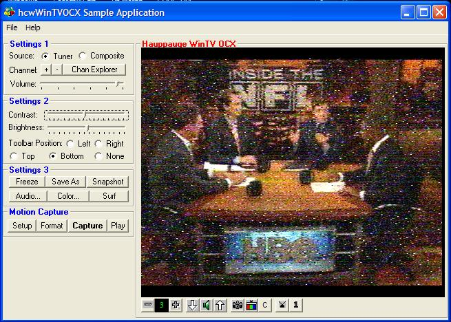



## Re: WinTv

### Description

I updated the zip, you will need to rename the "file" ext to ocx. Or goto http://hauppauge.lightpath.net/software/utils/wintvocx_19235.exe for the sdk. The Original post is here http://www.pscode.com/vb/scripts/ShowCode.asp?txtCodeId=39012&lngWId=1
 
### More Info
 

             |
---                |---
**Submitted On**   |2002-09-15 08:01:00
**By**             |[Robert Kersey](https://github.com/Planet-Source-Code/PSCIndex/blob/master/ByAuthor/robert-kersey.md)
**Level**          |Intermediate
**User Rating**    |5.0 (10 globes from 2 users)
**Compatibility**  |VB 6\.0
**Category**       |[Complete Applications](https://github.com/Planet-Source-Code/PSCIndex/blob/master/ByCategory/complete-applications__1-27.md)
**World**          |[Visual Basic](https://github.com/Planet-Source-Code/PSCIndex/blob/master/ByWorld/visual-basic.md)
**Archive File**   |[Re\_\_WinTv1324679172002\.zip](https://github.com/Planet-Source-Code/robert-kersey-re-wintv__1-39083/archive/master.zip)

